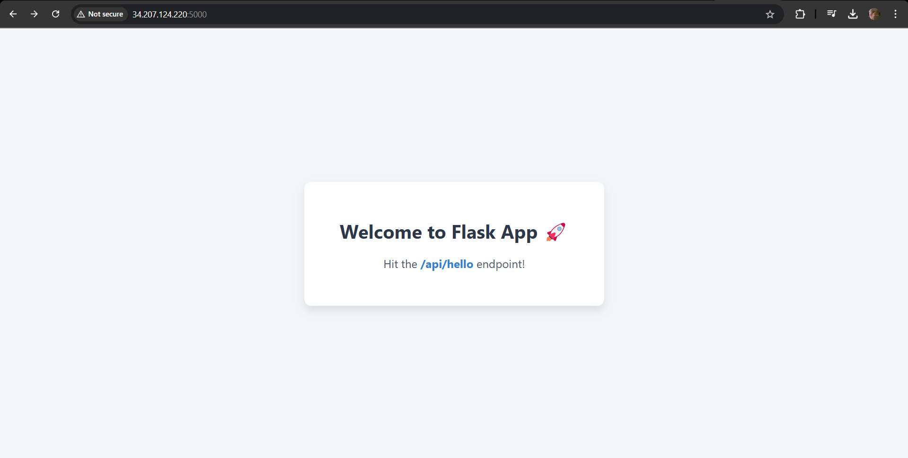
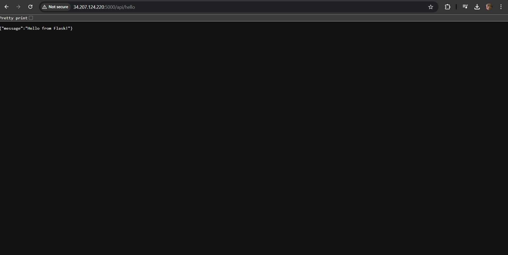
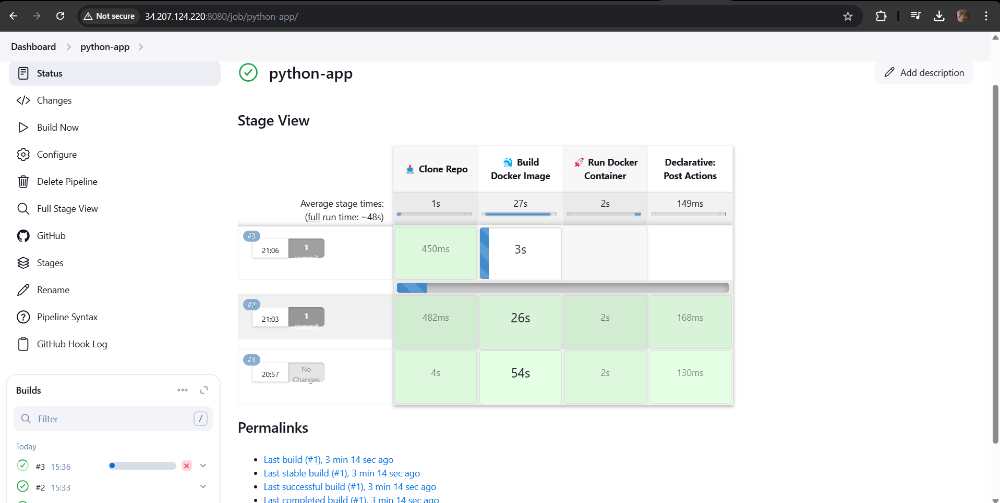
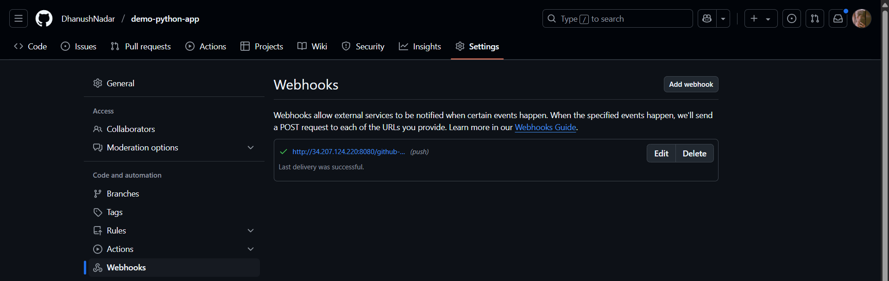

# Flask Web App with Jenkins CI/CD & Docker

This is a lightweight Python Flask web application that serves a static HTML homepage and exposes a simple REST API. The project includes a complete CI/CD setup using **Jenkins**, **Docker**, and **GitHub Webhooks**, allowing you to automate builds and deployments with each code commit.

---

## 🖼️ Screenshots

### 🏠 Main Page


### 🛠️ API Endpoint (`/api/hello`)


---

## 📦 What This App Does

This app has two core routes:

- `/` → Renders a beautiful HTML page with inline CSS
- `/api/hello` → Returns a JSON message: `{"message": "Hello from Flask!"}`

This makes it ideal for:
- Testing web deployment pipelines
- Demonstrating CI/CD workflows with Jenkins
- Learning Docker + Python integrations

---

## 🧰 Tech Stack

- 💻 **Python 3.10**
- 🌐 **Flask (Minimal Web Framework)**
- 🐳 **Docker (Multi-stage builds)**
- 🔧 **Jenkins (CI/CD Automation)**
- 🔗 **GitHub Webhooks (Push triggers)**

---

## 🌐 Accessing the App

Once deployed, the app will be accessible at:

```text
http://<EC2-IP>:5000/
```

> Make sure port 5000 is open in your EC2 security group.

## 🔁 Full CI/CD Workflow Overview


Here’s how the pipeline works:

- ✅ **Developer pushes code to GitHub**
- 🔔 **GitHub triggers a Webhook**
- 🧩 **Jenkins receives the webhook** and pulls the latest code from Git SCM
- ⚙️ **Jenkins runs the `Jenkinsfile`**, which:
  - Clones the Git repository
  - Builds the Docker image
  - Runs the Flask app inside a Docker container
- 🌍 **Flask app is now running and accessible at**  
  `http://<EC2-IP>:5000`

---

## ⚙️ How the Webhook Works


- GitHub Webhook is configured to `POST` to your Jenkins server:

> http://<JENKINS-IP>:8080/github-webhook/


### 🔄 On each commit to your GitHub repository:

- GitHub **notifies Jenkins**
- Jenkins **executes the Jenkinsfile** from the repo
- A new **Docker image is built**
- The app is launched and served from the container 🎉

## 📂 Project Structure

```bash
.
├── app.py               # Main Flask app  
├── test_app.py          # Basic test script  
├── requirements.txt     # Flask dependencies  
├── Dockerfile           # Multi-stage Dockerfile  
├── Jenkinsfile          # CI/CD pipeline config  
├── README.md            # This file 💡  
├── .gitignore           # Git exclusions  
├── .dockerignore        # Docker build exclusions  
└── images/              # Screenshots for docs  
```


---

## 🚀 How to Run Locally

```bash
# 1. Install dependencies
pip install -r requirements.txt

# 2. Run the app
python app.py

# 3. Visit in your browser
http://localhost:5000/
```

## 🐳 Run with Docker

```bash
# Build the Docker image
docker build -t flask-ci-cd-app .

# Run the container
docker run -p 5000:5000 flask-ci-cd-app
```


## 🧪 Run Tests

```bash
python test_app.py
```

> Made with ❤️ by Dhanush Nadar – elevating DevOps pipelines one push at a time!

